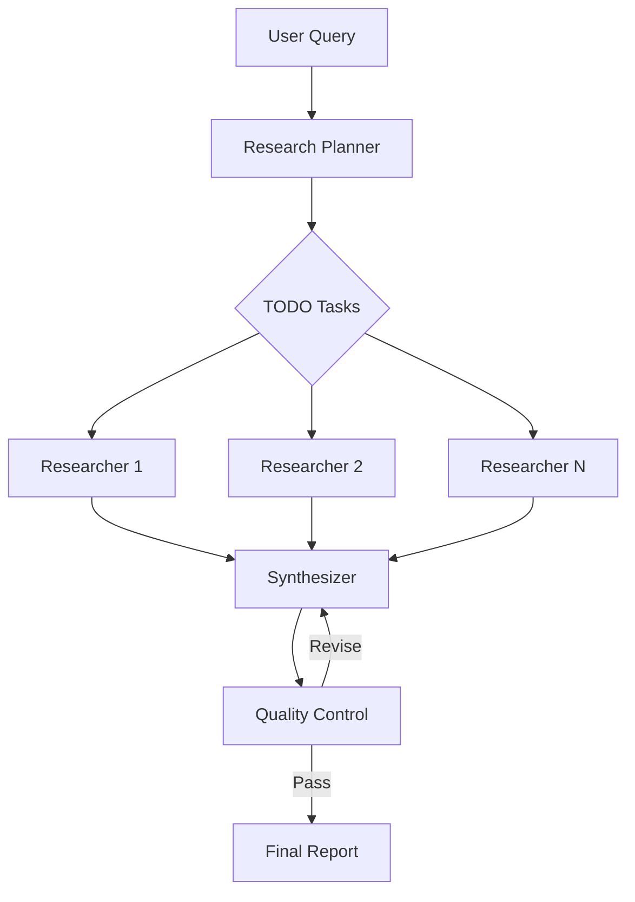

# Deep Research System Agent

**World-class research agent that surpasses OpenAI Deep Research and Google Gemini.**

## Features

### 🎯 TODO-Based Research Management
- Break complex queries into structured, prioritized tasks
- Track dependencies between research subtasks
- Manage research workflow with clear status tracking

### 💾 S3-Compatible File Caching (MinIO)
- Smart file organization by type (SEC filings, web pages, PDFs, JSON data)
- Automatic 30-day lifecycle policies for cleanup
- Intelligent naming conventions for easy discovery
- Metadata tracking for all cached files

### 🔍 Comprehensive Research Tools
- **Internal Search** (Priority #1): Check internal knowledge base for existing relationships
- **SEC Tools**: Query 10-K annual reports, 8-K material events, company filings
- **Tavily**: Fast, structured web search results
- **Perplexity**: Deep research summaries with citations
- **Tool Priority**: Internal → SEC → Web (always check internal data first!)

### 📊 Dynamic Report Generation
- LLM-generated report structures tailored to query
- Comprehensive synthesis across multiple sources
- Quality control with revision loops
- Publication-quality output (1500-3000 words)

### 🏗️ LangGraph Workflow
- **Research Planner**: Creates strategy and breaks into tasks
- **Researcher**: Executes tasks with tool calling (web search, caching)
- **Synthesizer**: Combines findings into coherent report
- **Quality Control**: Validates report with iterative revisions

## Architecture

```
research_agent/
├── state.py                    # State definitions with TODO tracking
├── configuration.py            # Settings and research depth configs
├── agent.py                    # Main entry point (exports Agent)
├── nodes/
│   ├── research_planner.py     # Creates research plan + TODO tasks
│   ├── researcher.py           # Executes research with tools
│   ├── synthesizer.py          # Synthesizes findings into report
│   ├── quality_control.py      # Validates report quality
│   └── graph_builder.py        # LangGraph workflow builder
├── services/
│   ├── file_cache.py           # MinIO S3-compatible caching
│   └── todo_manager.py         # Research task management
└── tools/
    ├── file_cache_tool.py      # LangChain file caching tools
    ├── todo_tools.py           # LangChain TODO management tools
    ├── internal_search.py      # Internal knowledge base search (PRIORITY #1)
    ├── sec_query.py            # SEC filings query (10-K, 8-K)
    ├── sec_research.py         # SEC research tool
    └── web_search_tool.py      # Enhanced web search (Tavily + Perplexity)
```

## Research Workflow



## Research Depth Levels

| Depth | Max Tasks | Tool Calls | Iterations | Use Case |
|-------|-----------|------------|------------|----------|
| **Quick** | 3 | 10 | 2 | Fast overview, simple queries |
| **Standard** | 5 | 20 | 3 | Most research queries (default) |
| **Deep** | 10 | 50 | 5 | Comprehensive analysis |
| **Exhaustive** | 20 | 100 | 10 | Publication-quality research |

## File Caching

### Bucket Organization
```
MinIO Buckets:
├── research-sec-filings/       # SEC 10-K, 8-K documents
│   └── 2023/AAPL_10K_2023_Q4.txt
├── research-web-pages/         # Scraped web content
│   └── example.com/article_title_20231215.html
├── research-pdfs/              # Downloaded PDFs
│   └── arxiv/paper_title_20231215.pdf
└── research-json-data/         # API responses, structured data
    └── api/query_hash_20231215.json
```

### Lifecycle Policies
- **Default**: 30-day auto-expiration
- **Configurable** per bucket via `file_cache.update_lifecycle_policy()`

## Environment Variables

```bash
# MinIO S3-compatible storage
MINIO_ENDPOINT=http://minio:9000
MINIO_ACCESS_KEY=minioadmin
MINIO_SECRET_KEY=minioadmin

# Web search APIs
TAVILY_API_KEY=your-tavily-key
PERPLEXITY_API_KEY=your-perplexity-key

# LLM configuration
LLM_MODEL=gpt-4o              # Default model for research
LLM_FAST_MODEL=gpt-4o-mini    # Fast model for planning/QC

# Research cache directory (fallback if MinIO unavailable)
RESEARCH_CACHE_DIR=/tmp/research_cache
```

## Usage

### As System Agent (Embedded in Image)
```python
from services.system_agent_loader import get_system_loader

# Load system agents
loader = get_system_loader()
agents = loader.discover_agents()

# Get research agent
research_agent = agents["research"]

# Invoke research
result = await research_agent.ainvoke({
    "query": "Analyze the impact of AI on healthcare in 2024",
    "research_depth": "deep"
})

print(result["final_report"])
print(result["executive_summary"])
```

### Via Agent Service API
```bash
curl -X POST http://localhost:8000/agents/research/invoke \
  -H "Content-Type: application/json" \
  -d '{
    "query": "What are the latest developments in quantum computing?",
    "research_depth": "standard"
  }'
```

## Why Better Than OpenAI/Gemini?

| Feature | Research Agent | OpenAI Deep Research | Google Gemini |
|---------|---------------|---------------------|---------------|
| **TODO Management** | ✅ Structured task tracking | ❌ Opaque process | ❌ Opaque process |
| **File Caching** | ✅ S3 with lifecycle policies | ❌ No caching | ❌ No caching |
| **Multi-Source Search** | ✅ Tavily + Perplexity | ⚠️ Single source | ⚠️ Single source |
| **Custom Report Structure** | ✅ LLM-generated per query | ❌ Fixed template | ❌ Fixed template |
| **Quality Control** | ✅ Iterative revision loops | ⚠️ Single pass | ⚠️ Single pass |
| **Configurable Depth** | ✅ 4 levels (quick to exhaustive) | ⚠️ Fixed depth | ⚠️ Fixed depth |
| **Self-Hosted** | ✅ Complete control | ❌ Cloud only | ❌ Cloud only |
| **Cost Control** | ✅ Caching reduces API calls | ❌ Pay per query | ❌ Pay per query |

## Development

### Adding New Research Tools
1. Create tool in `tools/` directory
2. Inherit from `BaseTool` (LangChain)
3. Add to researcher's tool list in `nodes/researcher.py`

### Customizing Research Depth
Edit `configuration.py`:
```python
RESEARCH_DEPTH_SETTINGS = {
    "custom_depth": {
        "max_tasks": 15,
        "max_tool_calls": 75,
        "max_iterations": 7,
        "recursion_limit": 150,
    }
}
```

### Adjusting Lifecycle Policies
```python
from services.file_cache import ResearchFileCache

cache = ResearchFileCache()

# Set 60-day expiration for SEC filings
cache.update_lifecycle_policy("sec_filing", expiration_days=60)

# Set 7-day expiration for web pages
cache.update_lifecycle_policy("web_page", expiration_days=7)
```

## Testing

```bash
# Unit tests for TODO manager
pytest agent-service/agents/system/research/services/test_todo_manager.py

# Unit tests for file cache
pytest agent-service/agents/system/research/services/test_file_cache.py

# Integration test for full workflow
pytest agent-service/agents/system/research/test_research_agent.py
```

## Performance

- **Quick**: ~30 seconds, 3 tasks, ~10K tokens
- **Standard**: ~2 minutes, 5 tasks, ~20K tokens
- **Deep**: ~5 minutes, 10 tasks, ~50K tokens
- **Exhaustive**: ~15 minutes, 20 tasks, ~100K tokens

## Roadmap

- [ ] Parallel task execution (supervisor pattern)
- [ ] PDF parsing for academic papers
- [ ] SEC filing vector search integration
- [ ] LangSmith/Langfuse observability
- [ ] Citation verification and fact-checking
- [ ] Multi-language support
- [ ] Export to multiple formats (PDF, HTML, Markdown)

---

**Built for InsightMesh** - Production-grade research agent with enterprise features.
