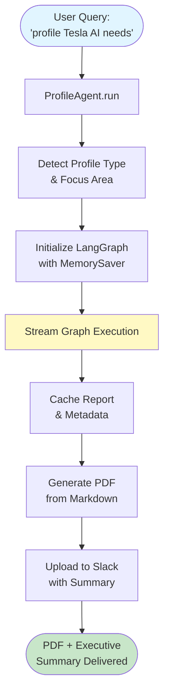
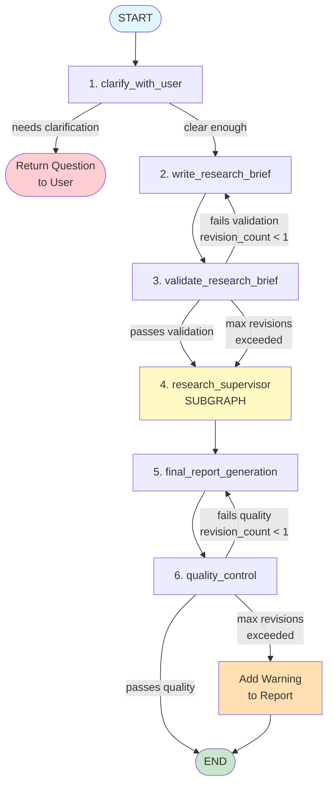
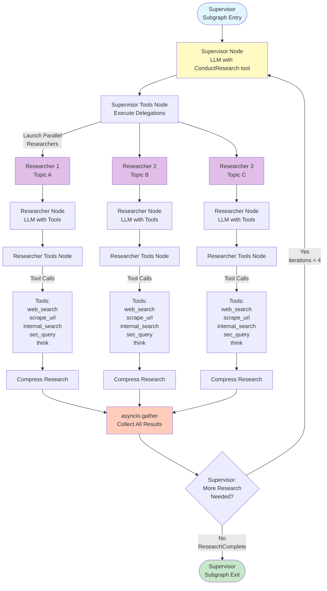
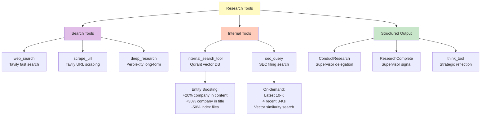
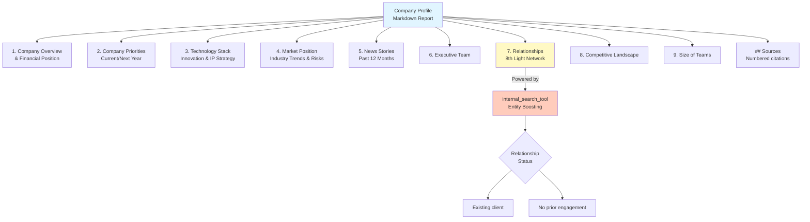
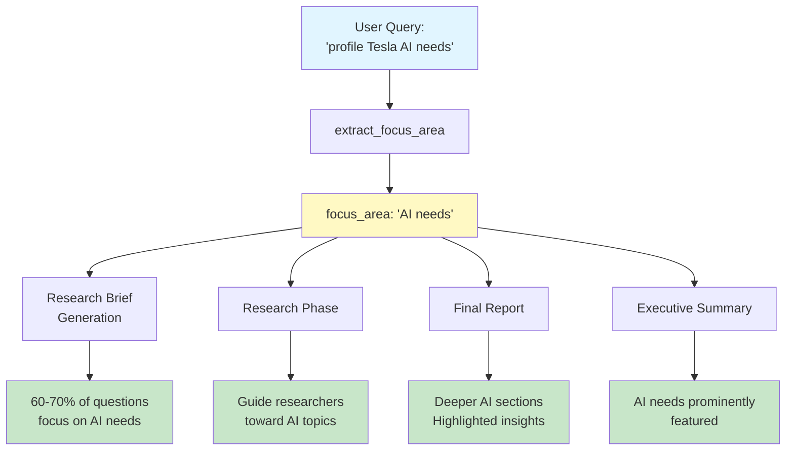
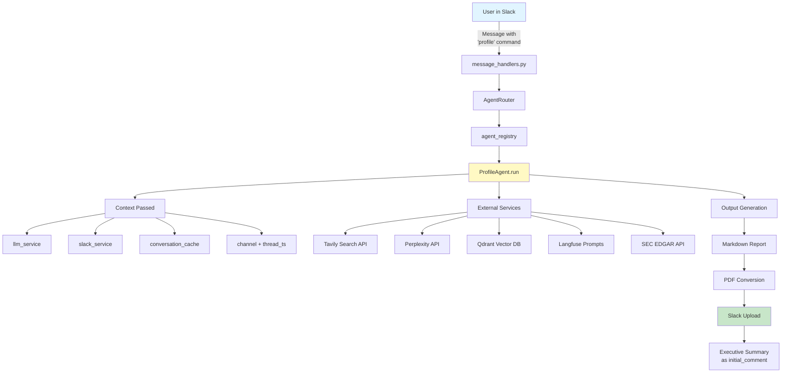
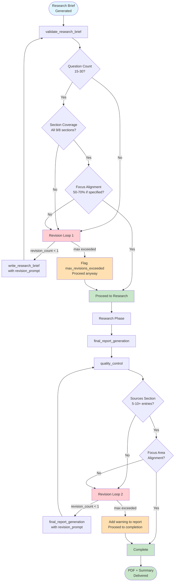
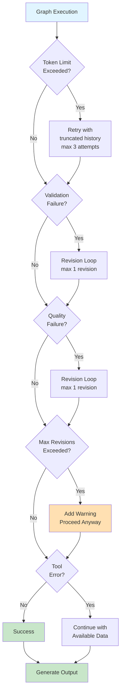

# Profile Agent Architecture Diagram

## High-Level Flow



## LangGraph State Machine (6 Nodes + Revision Loops)



## Research Supervisor Subgraph (Parallel Researchers)



## State Structure

```mermaid
graph TB
    State[ProfileAgentState<br/>TypedDict] --> Input[Input Fields]
    State --> Research[Research Brief]
    State --> Notes[Research Notes]
    State --> Report[Final Report]
    State --> QC[Quality Control]
    State --> Meta[Metadata]

    Input --> |query: str| Q[User's query]
    Input --> |messages: list| M[Conversation history]

    Research --> |research_brief: str| RB[15-30 research questions]
    Research --> |brief_passes_validation: bool| BV[Validation status]
    Research --> |brief_revision_count: int| BR[Revision attempts]

    Notes --> |raw_notes: list| RN[Unprocessed findings]
    Notes --> |notes: list| CN[Compressed findings]
    Notes --> |research_iterations: int| RI[Research rounds]

    Report --> |final_report: str| FR[Markdown report]
    Report --> |executive_summary: str| ES[3-5 bullet summary]

    QC --> |passes_quality: bool| PQ[Quality validation]
    QC --> |revision_count: int| RC[Report revisions]
    QC --> |max_revisions_exceeded: bool| MR[Revision limit flag]

    Meta --> |profile_type: str| PT[company/employee]
    Meta --> |focus_area: str| FA[User's specific focus]

    style State fill:#e1f5ff
```



## Tool Ecosystem



## Company Profile Structure (9 Sections)



## Focus Area Flow (Dynamic Research Emphasis)



## Integration Points



## Validation Gates (Quality Control)



## Configuration & Settings

```yaml
ProfileConfiguration:
  # Parallel Research
  max_concurrent_research_units: 3

  # Research Iterations
  max_researcher_iterations: 4
  max_react_tool_calls: 8

  # Search API
  search_api: TAVILY  # or PERPLEXITY

  # Models
  research_model: "openai:gpt-4o-mini"
  final_report_model: "openai:gpt-4o"
  final_report_model_max_tokens: 60000

  # Behavior
  allow_clarification: false
  pdf_style: PROFESSIONAL  # MINIMAL, PROFESSIONAL, DETAILED
```

## Error Handling & Resilience



---

## Key Insights

### 1. **Hierarchical LangGraph Architecture**
- Main graph orchestrates 6 core nodes
- Supervisor subgraph manages parallel researchers
- Each researcher runs its own tool-calling loop

### 2. **Quality Gates with Controlled Revisions**
- Research brief validation (max 1 revision)
- Final report quality control (max 1 revision)
- Graceful degradation if max revisions exceeded

### 3. **Parallel Research for Speed**
- Up to 3 concurrent researchers
- Each focuses on different topics
- Supervisor iterates up to 4 times

### 4. **Entity Boosting for Relationship Detection**
- Prevents false positives (Vail Resorts, Costco cases)
- Prioritizes company-specific documents
- Penalizes generic index files

### 5. **Focus Area Guidance Throughout**
- Extracted once at start
- Influences brief generation (60-70% allocation)
- Guides researchers
- Emphasized in final report
- Featured in executive summary

### 6. **External Prompt Versioning**
- Langfuse integration for prompt management
- Enables A/B testing and iteration
- Centralized prompt control

### 7. **Comprehensive Error Handling**
- Token limit retries
- Validation failures with revision loops
- Tool errors don't block workflow
- Max revision safeguards

### 8. **Stateful Execution with Checkpointer**
- MemorySaver singleton preserves state
- Enables multi-turn conversations
- Thread-level caching for follow-ups
