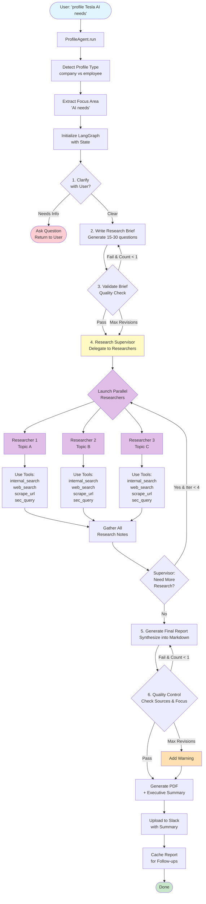

# Profile Agent Flowchart

```mermaid
flowchart TD
    Start([User: 'profile Tesla AI needs']) --> Entry[ProfileAgent.run]

    Entry --> Detect[Detect Profile Type<br/>company vs employee]
    Detect --> Extract[Extract Focus Area<br/>'AI needs']
    Extract --> Init[Initialize LangGraph<br/>with State]

    Init --> Node1{1. Clarify<br/>with User?}
    Node1 -->|Needs Info| AskQ([Ask Question<br/>Return to User])
    Node1 -->|Clear| Node2[2. Write Research Brief<br/>Generate 15-30 questions]

    Node2 --> Node3{3. Validate Brief<br/>Quality Check}
    Node3 -->|Fail & Count < 1| Node2
    Node3 -->|Pass| Node4[4. Research Supervisor<br/>Delegate to Researchers]
    Node3 -->|Max Revisions| Node4

    Node4 --> Parallel{Launch Parallel<br/>Researchers}
    Parallel --> R1[Researcher 1<br/>Topic A]
    Parallel --> R2[Researcher 2<br/>Topic B]
    Parallel --> R3[Researcher 3<br/>Topic C]

    R1 --> Tools1[Use Tools:<br/>internal_search<br/>web_search<br/>scrape_url<br/>sec_query]
    R2 --> Tools2[Use Tools:<br/>internal_search<br/>web_search<br/>scrape_url<br/>sec_query]
    R3 --> Tools3[Use Tools:<br/>internal_search<br/>web_search<br/>scrape_url<br/>sec_query]

    Tools1 --> Gather[Gather All<br/>Research Notes]
    Tools2 --> Gather
    Tools3 --> Gather

    Gather --> MoreResearch{Supervisor:<br/>Need More<br/>Research?}
    MoreResearch -->|Yes & Iter < 4| Parallel
    MoreResearch -->|No| Node5[5. Generate Final Report<br/>Synthesize into Markdown]

    Node5 --> Node6{6. Quality Control<br/>Check Sources & Focus}
    Node6 -->|Fail & Count < 1| Node5
    Node6 -->|Pass| GenPDF[Generate PDF<br/>+ Executive Summary]
    Node6 -->|Max Revisions| Warning[Add Warning]
    Warning --> GenPDF

    GenPDF --> Upload[Upload to Slack<br/>with Summary]
    Upload --> Cache[Cache Report<br/>for Follow-ups]
    Cache --> End([Done])

    style Start fill:#e1f5ff
    style End fill:#c8e6c9
    style AskQ fill:#ffcdd2
    style Warning fill:#ffe0b2
    style Node4 fill:#fff9c4
    style Parallel fill:#e1bee7
    style R1 fill:#e1bee7
    style R2 fill:#e1bee7
    style R3 fill:#e1bee7
```
